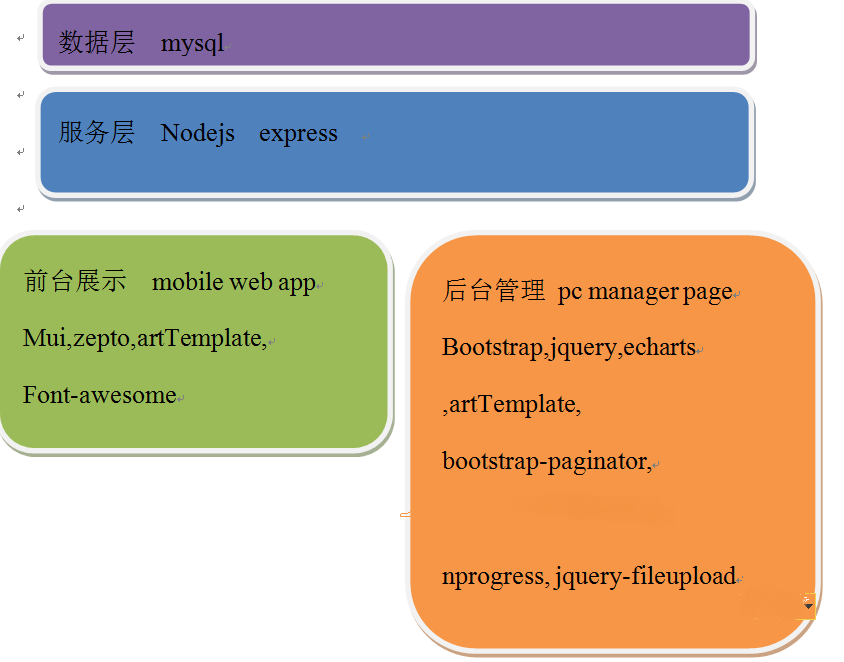
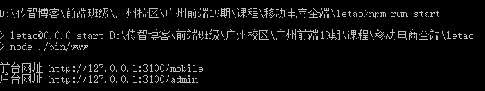
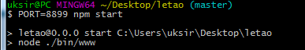
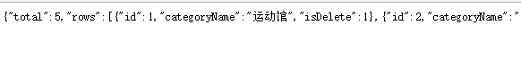
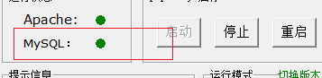

# 1. 移动电商项目

## 1.1. 介绍
  乐淘商城是一个针对鞋类商品的在线交易平台，合适就穿，不合适就换。乐淘为您支付退换货的物流费用，以最快速度把换好的鞋子送到您手中，最好的品牌，最低的价格。乐淘族凭借雄厚的资金实力和在电子商务业界的诚信积累，与Nike、Adidas、Converse、NewBalance等国际大牌深度合作。保证了产品与专卖店同步更新，让您不出家门能最快速度买到当季新款名牌鞋。乐淘族坚持自营，减少中间环节，让利给用户，因此所有产品价格均低于传统销售渠道。
## 1.2. 项目模块


## 1.3. 项目架构



# 2. 资源地址

| 名称         | 地址                                          |
| ------------ | --------------------------------------------- |
| demo-前台    | http://letao.ak48.xyz/mobile/index.html       |
| demo-后台    | http://letao.ak48.xyz/admin/login.html        |
| 上课代码     | https://gitee.com/ukSir/letao19.git           |
| Mui官网      | http://dev.dcloud.net.cn/mui/                 |
| Mui-示例     | http://www.dcloud.io/hellomui/                |
| Font-awesome | http://fontawesome.dashgame.com/              |
| arttemplate  | http://aui.github.io/art-template/zh-cn/docs/ |
| zepto        | http://www.css88.com/doc/zeptojs_api/         |

# 3. 帐号和密码

为了确保软件的环境都一样 建议我们统一所有的用户名和密码

| 软件                            | 用户名 | 密码   |
| ------------------------------- | ------ | ------ |
| mysql                           | root   | 123456 |
| 乐淘项目文件 letao/models/db.js | root   | 123456 |
| 前台用户名和密码                | itcast | 111111 |
| 后台用户名和密码                | root   | 123456 |

# 4. 项目环境搭建

因为本项目的启动需要配置好相关环境,因此在配置环境的时候要仔细阅读文档,尽量减少错误

## 4.1. 安装nodejs

nodejs的版本号为 **10.3.0**  

[在线下载地址](https://nodejs.org/download/release/v8.9.1/)

### 4.1.1. 步骤:

1. 直接双击打开安装文件  **node-v10.3.0-x64.msi**  为了减少出错,建议将安装路径修改为 `D:\nodejs\`

2. 一直点击下一步即可 直到提示安装成功

3. 安装成功后,打开命令行工具 输入 `node -v` 出现了版本号 则代表成功

4. 修改node下载地址  由 **国内** 改为 **国外**

   ```bash
   # 设置 
   npm config set registry https://registry.npm.taobao.org
   # 查看是否设置成功
   npm config get registry //提示 https://registry.npm.taobao.org 则为成功
   ```


## 4.2. 导入数据

mysql安装成功后,此时还没有任何数据,因此 我们需要将数据填充到mysql中.

1. 运行phpStudy.exe   启动 **mysql**
2. 打开 **navicat.exe** 
3. 双击 **navicat.exe** 中的连接 **localhost_3306**
4. 右键 **localhost_3306** 在弹出的菜单中选择 **运行SQL文件**
5. 选择 **letao.sql** 点击 **开始**  直到运行完毕(很快的)  点击 **关闭**
6. 重启 **navicat.exe**  点击 **localhost_3306**  发现里面多了一个数据库 **letao**


## 4.3. 启动项目

在你想要保存项目的位置 打开git bash 开始克隆代码

```bash
git clone https://gitee.com/ukSir/letao19.git
```

**进入到项目文件夹内**

**cmd** 中 输入以下命令 开始安装依赖 等待安装成功

```bash
npm i
```

**运行项目**

```bash
npm run start 
```

出现以下表示启动成功




### 4.3.1. 修改数据库连接密码

此时打开项目代码 **根目录/models/db.js**, 

填入你mysql正确的用户名和密码(root和root) 

**一般不用修改**

```javascript
const pool  = mysql.createPool({
  // 主机号 不用修改
    host : '127.0.0.1',
  // 用户名
    user : 'root',
  // 密码
    password : '123456',
  // 数据库名称
    database : 'letao'
});
```

此时 在项目的根目录下 **MyLeTao/** 打开 命令行工具 输入:

```bash
// 如果发现端口号被占用 可以修改端口号如 8899 
PORT=8899 npm start 
```



此时在浏览器中输入 地址

```bash
http://127.0.0.1:3100/category/queryTopCategory
```

**项目搭建成功**



### 4.3.2. 修改默认端口号

如果在本机中需要同时运行多个乐淘的项目,因为每一个项目占用的端口号不一样.或者存在端口号占用,可以按照以下表格进行配置

| 项目         | 端口号 |
| ------------ | ------ |
| 老师上课代码 | 3100   |
| 自己项目代码 | 3200   |

可以在 项目文件夹内 找到文件  **bin/www**  中的第15行进行修改

```
// 修改 3000 为你要的端口即可
var port = normalizePort(process.env.PORT || '3000');
```

注意 也也可在 启动项目的时候输入 以下代码进行修改

```
PORT=3100 npm start
```


## 4.4. 总结

​	当重启电脑后,想要再次启动项目时,执行以下步骤确保项目启动成功

1. 启动数据库 **phpStudy**

   

2. 启动 **node**  `npm run start`

   

3. 测试接口,看有没有返回数据

   ```bash
   http://127.0.0.1:3100/category/queryTopCategory
   ```

   

   


# 5. 数据接口

[接口文档](api.md)